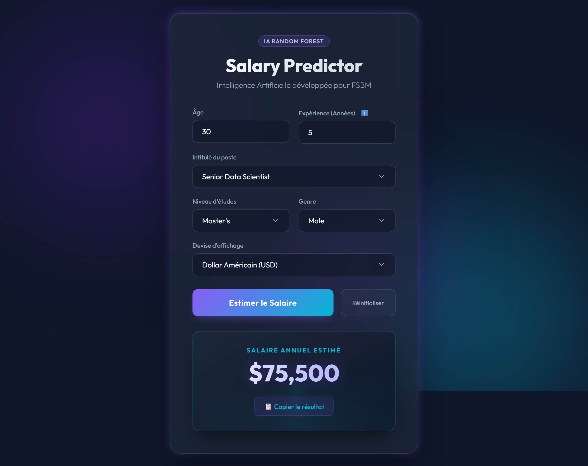

<div align="center">
  
  
  # 🔮 Salary Prediction AI
  ### Full-Stack Machine Learning Pipeline & REST API

  [](https://www.python.org/downloads/)
  [](https://fastapi.tiangolo.com)
  [](https://scikit-learn.org/)
  [](https://opensource.org/licenses/MIT)

</div>

<br>

A complete end-to-end Data Science and Machine Learning project developed as part of the **Master of Excellence in Artificial Intelligence** at the Faculty of Sciences Ben M'Sick (Université Hassan II). 

This project aims to accurately predict annual salaries based on professional profiles using a robust **Random Forest Pipeline** deployed via a dynamic **FastAPI** backend and a premium **Glassmorphism web interface**.

---

## ✨ Key Features

- **🛡️ unified ML Pipeline**: Implements Scikit-Learn's `ColumnTransformer` and `Pipeline` objects to strictly prevent **Data Leakage** during preprocessing.
- **🌲 Optimized Random Forest**: Hyperparameters tuned via `GridSearchCV` achieving an **$R^2$ score of 0.898** and a Mean Absolute Error (MAE) of **$8,847**.
- **⚡ Async REST API**: High-performance backend built with FastAPI, including Pydantic validation and auto-generated Swagger documentation.
- **🎨 Premium UI**: "Glassmorphism" aesthetic with smooth CSS mesh gradients, Count-up animations, and real-time backend synchronization.
- **💱 Live Currency Conversion**: Instant client-side salary conversion between USD, EUR, and MAD (Moroccan Dirham).

---

## 🏗️ Architecture

```text
📦 salary-prediction
 ┣ 📂 Rapport_Projet_Python     # LaTeX Academic Report & Assets
 ┣ 📂 server
 ┃ ┣ 📂 data                    # Raw and Processed Datasets (tracked via DVC)
 ┃ ┣ 📂 models                  # Serialized Joblib Pipelines & JSON options
 ┃ ┣ 📂 notebooks               # Jupyter Jupyter for EDA and Prototyping
 ┃ ┣ 📂 src                     # Core Machine Learning Scripts (Train, Inference)
 ┃ ┣ 📂 static                  # Frontend Assets (HTML, CSS, JS)
 ┃ ┗ 📜 app.py                  # FastAPI Application Entry Point
 ┣ 📜 README.md
 ┗ 📜 .gitignore
```

---

## 🚀 Installation & Setup

### 1. Clone the repository
```bash
git clone https://github.com/Youssef-srf/Salary-predictor.git
cd Salary-predictor/server
```

### 2. Create a Virtual Environment (Recommended)
**Windows (PowerShell):**
```powershell
python -m venv .venv
.\.venv\Scripts\Activate.ps1
```

**Linux/macOS:**
```bash
python3 -m venv .venv
source .venv/bin/activate
```

### 3. Install Dependencies
```bash
pip install -r requirements.txt
```

### 4. Fetch Datasets & Models (DVC)
The heavy `.csv` datasets and `.pkl` models are tracked using **Data Version Control (DVC)**. Pull them from the remote storage:
```bash
dvc pull
```

### 5. Launch the FastAPI Server
```bash
uvicorn app:app --reload
```
- **Web Interface:** [http://localhost:8000](http://localhost:8000)
- **Swagger UI (Docs):** [http://localhost:8000/docs](http://localhost:8000/docs)

---

## 🧠 Model Training

If you wish to retrain the model locally using the available data:

1. **Preprocess the raw data:**
   ```bash
   python src/preprocess.py
   ```
2. **Train the Random Forest Pipeline:**
   ```bash
   python src/train.py
   ```
   *This script runs `GridSearchCV` cross-validation, dynamically applies IQR outlier removal exclusively on the training set, and exports the `rfr_pipeline.pkl`.*

---

## 📡 API Usage Example (cURL)

You can access the model programmatically by hitting the `/predict" endpoint:

```bash
curl -X POST "http://localhost:8000/predict" \
  -H "Content-Type: application/json" \
  -d '{
    "age": 35,
    "gender": "Female",
    "education_level": "Master'\''s",
    "job_title": "Data Scientist",
    "years_of_experience": 8
  }'
```

**Response:**
```json
{
  "predicted_salary": 142500.0,
  "currency": "USD"
}
```

---

## 👨💻 Authors & Contributors

This academic project was developed by the following students of the **M1 AI Master's program (2025-2026)**:

- Adnane DAHBI
- Yassine FARIH
- Abdelkarim NARJISS
- Ali OUARRIRH 
- Mouad RADOUANI
- Youssef SARRAF

**Under the supervision of:**
- **Pr. Wafae SAIFI** (Project Supervisor)
- **Pr. Said NOUH** (Module Professor)

*Faculty of Sciences Ben M'Sick (FSBM) - Université Hassan II de Casablanca.*
